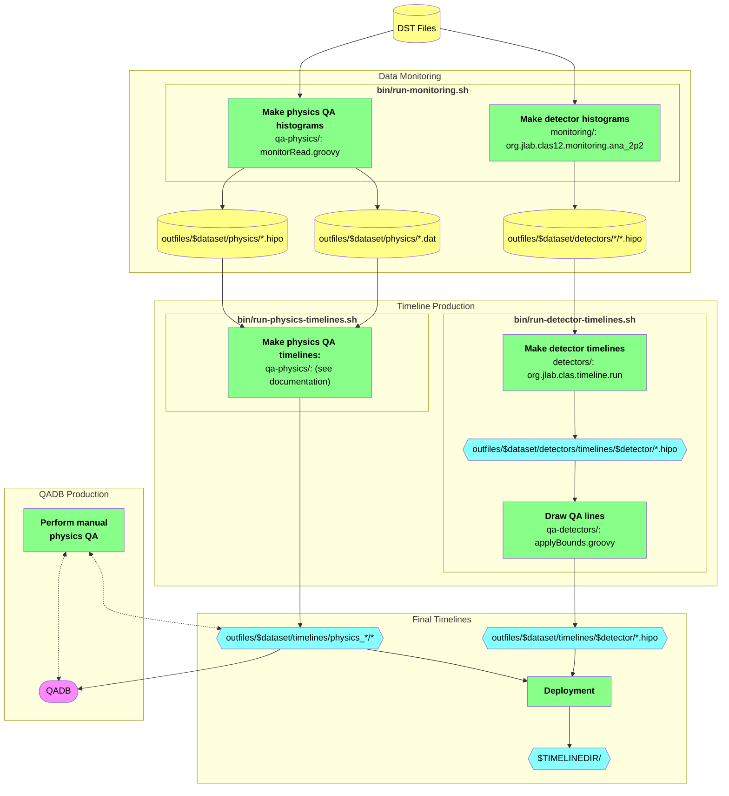

# clas12-timeline

Timeline production for CLAS12. Timelines are deployed to [clas12mon](https://clas12mon.jlab.org).

## Setup

To download,
```bash
git clone https://github.com/JeffersonLab/clas12-timeline.git
```

To build,
```bash
bin/build-all.sh        # standard build
bin/build-all.sh clean  # alternatively, a clean build
```

## Procedure

Two types of timelines are produced:
1. Detector timelines, to monitor detector parameters, histograms, and calibration
2. Physics timelines, to monitor higher-level quantities to perform Quality Assurance (QA) for physics analysis

NOTE: physics timeline production and QA are typically only valuable on high-statistics datasets; you may not want
to produce them if you are only interested in detector timelines.

Both of these timeline types are produced in two stages:

### Stage 1: Data Monitoring

This stage reads DST files and produces histograms and auxiliary files, which are then consumed by Stage 2 to produce the timelines. Since DST files are read, it is recommended to use a computing cluster.

To run this stage, execute:
```bash
bin/run-monitoring.sh
```
which will print the usage guide, along with some examples (since it was called with no arguments). With this script, you may run single jobs locally or multiple jobs in parallel on the computing cluster.

#### Details
- data monitoring for detector timelines is handled by the [`monitoring/` subdirectory](monitoring);
  see [its documentation](monitoring/README.md)
- data monitoring for physics timelines is handled by the [`qa-physics/` subdirectory](qa-physics);
  see [its documentation](qa-physics/README.md)

### Stage 2: Timeline Production and QA

After Stage 1 is complete, run the following Stage 2 scripts to produce the timeline `HIPO` files and to run the automatic QA procedures. Run them with no arguments to print the usage guides.

```bash
bin/run-detector-timelines.sh
bin/run-physics-timelines.sh
```

If all went well, a URL for the new timelines will be printed; open it in a browser to view them.


#### Details
- detector timeline production is handled by the [`detectors/` subdirectory](detectors);
  see [its documentation](detectors/README.md)
- QA of detector timelines is handled by the [`qa-detectors/` subdirectory](qa-detectors);
  see [its documentation](qa-detectors/README.md)
- physics timeline production and QA are handled by the [`qa-physics/` subdirectory](qa-physics);
  see [their documentation](qa-physics/README.md)

## QA Database (QADB) Production

The [QADB](https://github.com/JeffersonLab/clas12-qadb) is produced by the physics timeline QA, typically only for a fully cooked dataset. It is automatically produced from the physics QA, but it is highly recommended to perform a "manual QA" afterward, by looking at the automatic QA results, cross checking with the experimental log book, and modifying the QADB accordingly.

See [its documentation here](qa-physics) for more details.


# Flowchart
Here is a flowchart illustrating the data and steps for timeline production:


