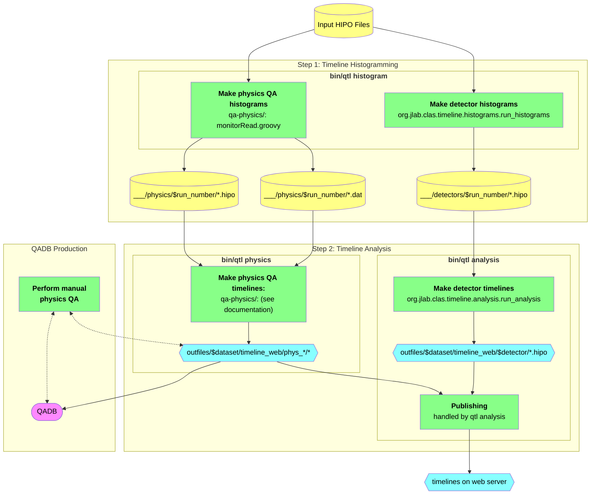

# How to Add a New Timeline

There are a few cases where a developer may want to make some updates to the script.

We strongly encourage you to work on this in the different branches from `main` and send pull requests.

To add more analysis scripts for step 2, create corresponding scripts in [`src/main/java/org/jlab/clas/timeline/analysis`](/src/main/java/org/jlab/clas/timeline/analysis).
The histogram (`H1F`) and graph (`GraphErrors`) objects should be included in the output `TDirectory` object. Not all, but most, timeline variables are fit results. We maintain the fitters in [`src/main/java/org/jlab/clas/timeline/fitter`](/src/main/java/org/jlab/clas/timeline/fitter).
To display the fit results on the `clas12mon` website, the `javascript` rendering the fit function needs the name of `F1D` to be "fit: " + the name of `H1F` (see `/group/clas/www/clas12mon/html/timeline/index.js` on `ifarm`.)

If the `H1F` objects do not exist in the monitoring output, the java codes in [`src/main/java/org/jlab/clas/timeline/histograms`](/src/main/java/org/jlab/clas/timeline/histograms) need to be updated for step 1.

To create new timelines for some detectors, follow these steps (_e.g._, <https://github.com/JeffersonLab/clas12-timeline/pull/304>)
1. Create the `DETECTOR_NAME.java`, in [`src/main/java/org/jlab/clas/timeline/histograms`](/src/main/java/org/jlab/clas/timeline/histograms). The easiest way is to copy and edit the existing java scripts.
2. Add three lines to [`src/main/java/org/jlab/clas/timeline/run_histograms.java`](/src/main/java/org/jlab/clas/timeline/run_histograms.java). For example, search for `ana_mon` to find out what these three lines are.
3. Create a `detector_name` directory in [`src/main/java/org/jlab/clas/timeline/analysis`](/src/main/java/org/jlab/clas/timeline/analysis).
4. Create a `detector_name_variable.groovy` script. One script for one variable is the norm. A script can store multiple timelines (_e.g._ [`src/main/java/org/jlab/clas/timeline/analysis/ft/ftc_time_neutral.groovy`](/src/main/java/org/jlab/clas/timeline/analysis/ft/ftc_time_neutral.groovy)).
5. Add the `detector_name` inside `detDirs` of [`bin/qtl-analysis`](/bin/qtl-analysis).

# Flowchart
Here is a flowchart illustrating the data and steps for timeline production. See the next section for details on output file organization.



# Output Files Tree

The following shows the tree of output files produced by code in this repository. A unique dataset name `$dataset` is used by most scripts, and almost all output files are contained in `outfiles/$dataset`.

Temporary files are additionally stored in `tmp/`, including backups (for the case when you re-run timelines for the same `$dataset`)

```
outfiles
└── $dataset
    │
    ├── timeline_detectors            # histograms, etc. for detector timelines, from `bin/qtl histogram`
    │   │
    │   ├── 5000                      # for run number 5000
    │   │   ├── out_HTCC_5000.hipo
    │   │   ├── out_LTCC_5000.hipo
    │   │   └── ...
    │   │
    │   ├── 5001                      # for run number 5001
    │   └── ...
    │
    ├── timeline_physics              # histograms, etc. for physics timelines, from `bin/qtl histogram`
    │   │
    │   ├── 5000                      # for run number 5000
    │   │   ├── data_table_5000.dat
    │   │   └── monitor_5000.hipo
    │   │
    │   ├── 5001                      # for run number 5001
    │   └── ...
    │
    ├── timeline_physics_qa           # transient files for the physics QA
    │   ├── outdat
    │   │   ├── qaTree.json           # QADB
    │   │   ├── qaTreeFD.json         # QADB for Forward Detector only
    │   │   ├── qaTreeFT.json         # QADB for Forward Tagger only
    │   │   ├── chargeTree.json       # FC charge info
    │   │   └── data_table.dat        # combined data_table*.dat from each run
    │   ├── outmon                    # timeline (and other) HIPO files
    │   └── outmon.qa                 # QADB timelines
    │
    ├── timeline_web_preQA            # detector timelines, before QA lines are drawn
    │   ├── htcc
    │   ├── ltcc
    │   └── ...
    │
    ├── timeline_web                  # final output timeline files, for deployment to web server
    │   │
    │   ├── htcc                      # detector timelines, with QA, from `bin/qtl analysis`
    │   ├── ltcc
    │   ├── ...
    │   │
    │   ├── phys_qa                   # physics timelines, with QA, from `bin/qtl physics`
    │   ├── phys_qa_extra             # extra physics QA timelines, for experts
    │   └── qadb                      # QADB results timeline
    │
    └── log                           # log files from `bin/qtl analysis` (not slurm logs (/farm_out/$LOGNAME/))
        ├── $timeline.out
        └── $timeline.err
```

# Notes on SWIF Workflows

For chef cooking workflow integration, the `bin/qtl histogram` command (which normally generates `slurm` jobs) has a specific mode `--swifjob`:
```bash
qtl histogram --swifjob --focus-detectors   # generate files for detector timelines
qtl histogram --swifjob --focus-physics     # generate files for physics QA timelines
```
Either or both of these commands is _all_ that needs to be executed on a runner node, within the cooking workflow; calling one of these will automatically run the wrapped code, with the following assumptions and conventions:
- input HIPO files are at `./` and only a single run will be processed
- run number is obtained by `RUN::config` from one of the HIPO files; all HIPO files are assumed to belong to the same run
- all output files will be in `./outfiles` (no `$dataset` subdirectory as above)

The output files `./outfiles/` are moved to the `swif` output target, following the usual file tree convention with run-number subdirectories:
```
top_level_target_directory
  │
  ├── detectors
  │   ├── 005000  # run 5000; corresponding output files from `--focus-detectors` in `outfiles/` are moved here
  │   ├── 005001  # run 5001
  │   └── ...
  │
  ├── physics
  │   ├── 005000  # run 5000; corresponding output files from `--focus-physics` in `outfiles/` are moved here
  │   └── ...
  │
  ├── recon
  │
  ├── train
  │
  └── ...
```
For compatibility with the file tree expected by downstream `qtl analysis` (see above), symbolic links may be made to these `timeline_{detectors,physics}` directories, but this is not required since these scripts also allow for the specification of an input directory.

Separate `--focus-detectors` and `--focus-physics` options are preferred, since:
- offers better organization of the contract data between `swif` jobs and downstream scripts
- often we will run one and not the other: `--focus-detectors` needs `mon` schema, whereas `--focus-physics` prefers high statistics
