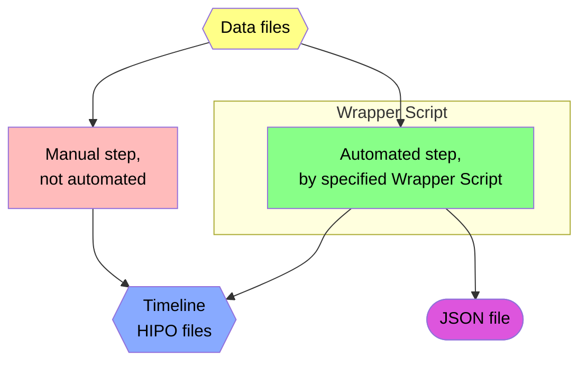
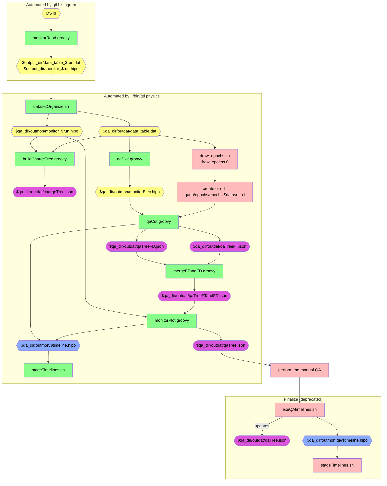

# Physics QA Timeline Production

This directory contains the code to produce "physics QA" timelines; it also produces
a Quality Assurance Database (QADB).

In this README, we describe the _code_.
- see [QADB documentation](/doc/qa.md) for the full QADB production procedure
- see [the top-level documentation](/README.md) for how to run the timeline code in general

The following sections explain what the [two steps of timeline production](/doc/procedure.md) do in detail;
below that is a flowchart for a visual guide.

## Step 1 (`qtl histogram`)
First step is to read DST or Skim files, producing HIPO files and data tables. This is
automated by `qtl histogram`.

* `monitorRead.groovy`
  * run with no arguments for usage guide
  * It is better to run this using `slurm`, but this can be run on a single skim file or
    directory of one run's DST files
  * Outputs:
    * `[output_directory]/data_table_${run}.dat`, which is a data table with the following columns:
      * run number
      * time bin number
      * minimum event number
      * maximum event number
      * minimum timestamp
      * maximum timestamp
      * sector
      * number of electron triggers in this sector
      * number of electrons in the forward tagger
      * DAQ-gated FC charge at beginning of time bin
      * DAQ-gated FC charge at end of time bin
      * DAQ-ungated FC charge at beginning of time bin
      * DAQ-ungated FC charge at end of time bin
      * average livetime
    * monitoring HIPO file, `[output_directory]/monitor_${runnum}.hipo`, contains several plots
      for each time bin

## Step 2 (`qtl physics`)

`qtl physics` does the following (see below for a flowchart):

* `datasetOrganize.sh`
  * this will concatenate `dat` files from the input directory into a single file
  * it will also generate symlinks to the relevant monitoring HIPO files
* `qaPlot.groovy` (on FD and FT)
  * reads data table and generates `monitorElec.hipo`
    * within this HIPO file, there is one directory for each run, containing several plots:
      * `grA*`: N/F vs. time bin
      * `grF*`: F vs. time bin
      * `grN*`: N vs. time bin
      * `grT*`: livetime vs. time bin
* `qaCut.groovy` (on FD and FT)
  * reads `monitorElec.hipo`, along with `../qadb/epochs/epochs.${dataset}.txt`, to build
    timelines for the online monitor
  * if `$useFT` is set, it will use FT electrons instead
  * the runs are organized into epochs, wherein each:
    * calculate N/F quartiles
      * `mq`: middle quartile, the overall median N/F
      * `lq`: lower quartile, the median N/F below `mq`
      * `uq`: upper quartile, the median N/F above `mq`
    * QA cut lines are set using an interquartile range (IQR) rule: `cutFactor` * IQR,
      where `cutFactor` adjusts the overall width of the cuts
      * the `cutFactor` is adjustable in cut definition YAML files (`../qadb/cutdefs`)
      * this is done for each sector individually
      * results are stored in `qaTree.json`
      * timelines HIPO files are also generated (which can be uploaded to the web server)
* `mergeFTandFD.groovy` to combine FD and FT results
* `monitorPlot.groovy`
  * this will read monitoring HIPO files and produce several timelines
    * Let X represent a quantity plotted in a timeline; the timeline plots the
      average value of X, versus run number
      * Several variables may be plotted together, on the same timeline plot,
        sharing the same vertical axis numbers, despite possibly having
        different units, for example,
        * Units of energy or momentum are GeV
        * Units of angle are radians
      * Clicking on a point will draw several plots below the timeline,
        corresponding to that run:
        * distribution of the average value of X, with one entry per time bin
        * graph of the average value of X versus time bin number
* copies timelines to output timeline directory using `stageTimelines.sh`

> [!NOTE]
> take a look at the "time bin analysis" plots by running `timebin_analysis/timebin_plot.C`

### Flowchart

Here is a visual representation of the scripts and their inputs and outputs.

Note: output directories `$output_dir` and `$qa_dir` are typically set by wrapper scripts, and may vary depending on how they are run.

Click here to show the Legend

