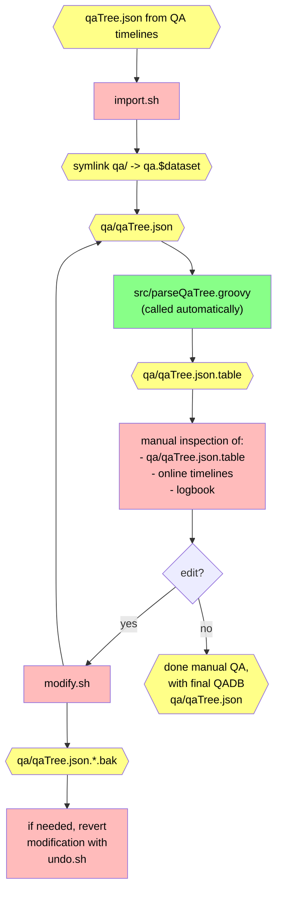

# QADB Tools

The initial QADB is produced by the timeline code; see [QADB Production Documentation](/doc/qa.md) for more information,
including the _full_ procedure how to produce a QADB.

This directory contains tools for modifying and refining the QADB. We recommend you work _within_ this
current directory, that is
- have your _own_ copy of this repository (`git clone`)
- make sure the code is built and installed locally (see [setup guide](/doc/setup.md))
- `cd` to _this_ directory (`cd qadb`)

## General Procedure for Manual QA

To run any tool, first **import** a QADB file (typically named `qaTree.json`); run the following for usage:
```bash
./import.sh    # run with no arguments for usage guide
```
The directory `qa.$dataset` will be produced, where `$dataset` is the dataset name you chose. A symbolic link
named `qa` will point to this directory, and we will refer to this directory as the "`qa` directory".

> [!NOTE]
> The `qa` symbolic link points to the _current working QADB_, that is, the QADB that many other tools will operate on; therefore, if you need to change which QADB you are working on, you can just change the directory to which `qa` points to, rather than re-importing.

Within the `qa` directory, the additional `qaTree.json.table` file will be produced, which is a human-readable
"table file" version of `qaTree.json`. See [the QADB repository documentation](https://github.com/JeffersonLab/clas12-qadb) for guidance on how
to read this file. We recommend opening this file and watching its changes while you run other scripts in this directory; this file
will be overwritten, so do not edit it yourself.

To modify the QADB, use
```bash
./modify.sh    # run with no arguments for usage guide
```
and to undo that modification, use
```bash
./undo.sh
```

### Flowchart




## Automatic QA Configuration

Some tools for automatic QA are included here too; the automatic QA precedes
the manual QA, and produces an "initial QADB". If you are performing an
independent manual QA as part of a cross check, you do not need to read this section.

The following configuration files are used by the timeline code, "step 2", to
establish the QA cuts; you may need to modify them to produce an appropriate
initial QADB. These directories contain configuration files for each dataset we produce for [the QADB](https://github.com/JeffersonLab/clas12-qadb):

| Files | Purpose |
| --- | --- |
| [`cutdefs/`](cutdefs) | configuration file for miscellaneous settings on the QA criteria; see [`qaCut.groovy`](/qa-physics/qaCut.groovy) for details |
| [`epochs/`](epochs) | definition of epochs; each line lists the first and last run of an epoch, with the possibility of including a comment (with `#`) |

> [!TIP]
> Use `draw_epochs.sh` to help establish epochs.

## Melding: combining `qaTree.json` file versions
This more advanced procedure is used if you need to combine two `qaTree.json` files

- you must read the script carefully and edit it for your use case
- for each run, the script will "combine" QA info from each of the `qaTree.json` files; the script must know what to do with each case
    - be careful if your `qaTree.json` files have different/overlapping sets of runs
- this procedure is useful if, _e.g_, you change bit definitions and want to update a `qaTree.json` file, with full control of each defect bit's behavior
- see [`meld/README.md`](meld/README.md)
