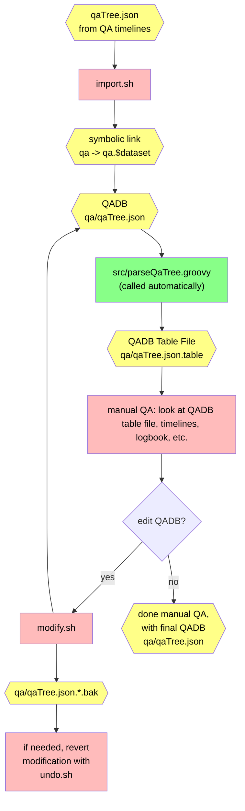

# QADB Tools

This directory contains tools for modifying and refining the QADB.

The initial QADB is produced by the timeline code; see [QADB Production Documentation](/doc/qa.md) for more information,
including the _full_ procedure how to produce a QADB.

We recommend you work _within_ this current directory, that is
- have your _own_ copy of this repository (`git clone`)
- make sure the code is built and installed locally (see [setup guide](/doc/setup.md))
- `cd` to _this_ directory (`cd qadb`)

## General Procedure for Manual QA

### Import
To run any tool, first **import** a QADB file (typically named `qaTree.json`); run:
```bash
./import.sh    # run with no arguments for usage guide
```
The directory `qa.$dataset` will be produced, where `$dataset` is the dataset name you chose. A symbolic link
named `qa` will point to this directory, and we will refer to this directory as the "`qa` directory".

> [!NOTE]
> The `qa` symbolic link points to the _current working QADB_, that is, the QADB that many other tools will operate on; therefore, if you need to change which QADB you are working on, you can just change the directory to which `qa` points to, rather than re-importing.

### Table File

Within the `qa` directory, the additional `qaTree.json.table` file will be
produced, which is a human-readable "table file" version of `qaTree.json`. Each
run begins with the keyword `RUN:`; lines below are for each of that run's QA
bins and their QA results, with the following syntax:
```
run_number  bin_number  defect_bits...
```
There may be multiple defect bits; if there are none, the symbol `|` is written instead.

Some QA bins include a comment (usually when the `Misc` defect bit is assigned), surrounded by
`::` symbols; the syntax is then:
```
run_number  bin_number  :: comment ::  defect_bits...
```

The defect bits have the following form:
```
bit_number-defect_name[list_of_sectors]
```
The list of sectors is not delimited, _e.g._, `125` means sectors 1, 2, and 5;
the word `all` is used in place of `123456`.

> [!TIP] We recommend opening this file and watching its changes while you run other scripts in this directory; this file
> will be overwritten, so do not edit it yourself.

### Modification

To modify the QADB, use
```bash
./modify.sh    # run with no arguments for usage guide
```
and to undo that modification, use
```bash
./undo.sh
```

See [QADB Production Documentation](/doc/qa.md) for the step-by-step procedure for using `modify.sh` to perform a manual QA.

### Flowchart

Here is a visual representation of the manual QA procedure:




## Automatic QA Configuration

Some tools for automatic QA are included here too; the automatic QA precedes
the manual QA, and produces an "initial QADB". If you are performing an
independent manual QA as part of a cross check, you do not need to read this section.

The following configuration files are used by the timeline code, "step 2", to
establish the QA cuts; you may need to modify them to produce an appropriate
initial QADB. These directories contain configuration files for each dataset we produce for [the QADB](https://github.com/JeffersonLab/clas12-qadb):

| Files | Purpose |
| --- | --- |
| [`cutdefs/`](cutdefs) | configuration file for miscellaneous settings on the QA criteria; see [`qaCut.groovy`](/qa-physics/qaCut.groovy) for details |
| [`epochs/`](epochs) | definition of epochs; each line lists the first and last run of an epoch, with the possibility of including a comment (with `#`) |

> [!TIP]
> Use `draw_epochs.sh` to help establish epochs.

## Melding: combining `qaTree.json` file versions
This more advanced procedure is used if you need to combine two `qaTree.json` files, which is only needed under special
circumstances; see [the `meld` directory](meld) for more information.
